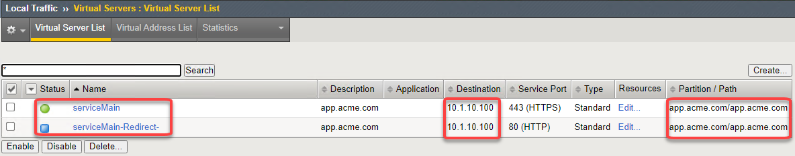

Lab 2 - Declarative Automation with AS3
===========================================

Objectives
----------

The intention of this lab will be to show how to work with declarative API calls leveraging the `Application Services 3 (AS3) <https://clouddocs.f5.com/products/extensions/f5-appsvcs-extension/latest/`__ framework.  AS3 delivers a JSON payload to the BIG-IP's declarative API interface.  Through this interface BIG-IP is able to inject the payload and create configuration.  This method allows for you to send a single API call to the BIG-IP and in turn delivers all the configuration we looked at in the imperative lab.

Task 2.1: Create
-----------------------------
In this task we are going to use AS3 JSON declaration to create two Virtual Servers (port 80 and 443), http profile, client ssl profile, persistence profile, node and pool all in one API call to our BIG-IP.

#. In Chrome make sure you are logged in to your BIG-IP

    +------------+--------------+
    | Username:  | admin        |
    +------------+--------------+
    | Password:  | admin        |
    +------------+--------------+

#. In Postman, expand **Lab 2 - Decalarative Automation with AS3**, **2.1 - Create** and click on **2.1.1 Deploy - app.acme.com**

    |2_1_deploy|

#. Examine the API call in the right pane.  We will use a POST method but instead of sending our calls to a specific collection we are sending it to the declarative interface at //mgmt//shared//appsvcs//declare. Click on the **Body** and let's take a deeper look at the JSON declaration.

    |deploy_app|

#. Starting with some basics we have the **AS3 Class**, **ADC Class**, **Tenant Class** and **Application Class**.
    - When just beginning do not modify the **AS3 Class**.
    - For the **ADC Class** we are going to give our application an ID of **app.acme.com-01** and a label of **app.acme.com**.  We are also going to list a **remark** or description.
    - The **Tenant Class** is where we identify the partition and route domain for this application.
    - The **Application Class** is where we decide on a template to use.

    |class_1|

#. Once we have declared a template we must define a **Service Class**.  We chose to use the https template so we will be using the **Service_HTTPS**.  It is under the **Service Class** that we begin to define our Virtual Server, profiles and pools to be used.

    |class_2|

#. Now that we have defined the initial structure of our application we need to begin defining the components our application needs to use.  The **Pool Class** is where we declare our pool, monitor and pool members.

    |class_3|

#. Now we need to add some definition to the profiles we have referenced like the **acme_https** http profile, client ssl profile, persistence profile and the pool monitor.

    +----------------------+--------------+
    | Monitor Class        | |monitor|    |
    +----------------------+--------------+
    | HTTP_Profile Class   | |http|       |
    +----------------------+--------------+
    | Persist Class        | |persist|    |
    +----------------------+--------------+
    | TLS_Server class     | |client_ssl| |
    +----------------------+--------------+
    | Certificate Class    | |ssl_cert|   |
    +----------------------+--------------+

#. We have verified we have a complete declaration.  Click on **Send** in Postman to send the complete declaration to BIG-IP.  We should receive a 200 OK an in the body of the response we should see results = success.

    |app_success|

#. Let's go examine the results in our BIG-IP.  Navigate to **Local Traffic --> Virtual Servers --> Virtual Server List**.  We do not see anything created here.  That is because we are in the **Common** partition.  AS3 is designed to create configuration in a **Tenant** or in BIG-IP terms **Partition**.  In the upper right corner click on the drop down menu and choose the **app.acme.com**

    |tenant|

#. Two Virtual Servers have been created for **app.acme.com**.  One exists on IP 10.1.10.100 for port 443 and one on port 80 as a redirect.

    |vs_app|

Task 2.2: Read
-----------------------------

Task 2.3: Update
-----------------------------

Task 2.4: Delete
-----------------------------

.. |deploy_app| image:: ./media/deploy_app.png
.. |class_1| image:: ./media/class_1.png

.. |http| image:: ./media/http.png
.. |persist| image:: ./media/persist.png

